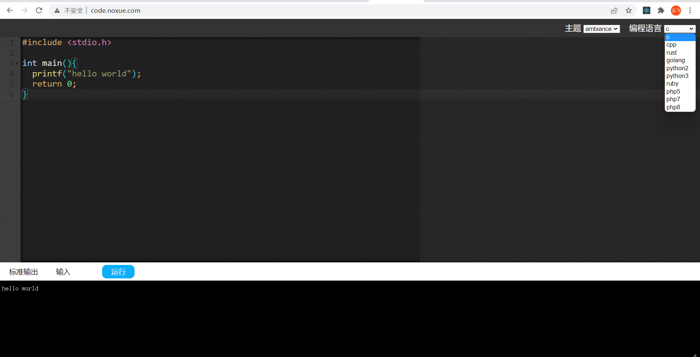

## 说明

* 这是在线编译器的前台界面，后端接口项目地址：<https://github.com/noxue/noxue-code>


## 部署

yarn build  

* 配置 nginx 伪静态规则，用于请求到后端接口，我接口部署在同服务器的8585端口，规则如下：

```nginx
location ^~ /api{
  proxy_pass http://127.0.0.1:8585;
}
```

## 效果图




## 联系方式

* 有bug请联系我，微信qq同号：173126019
